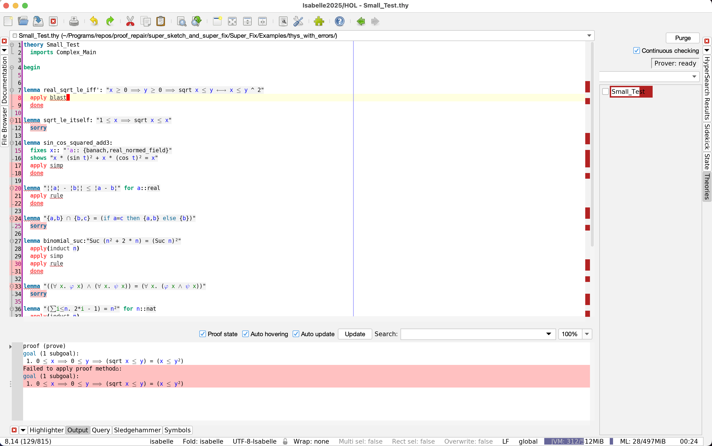
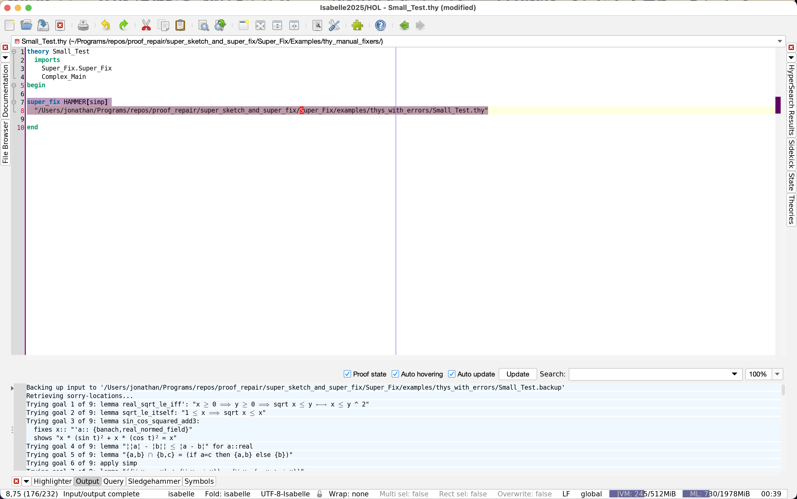
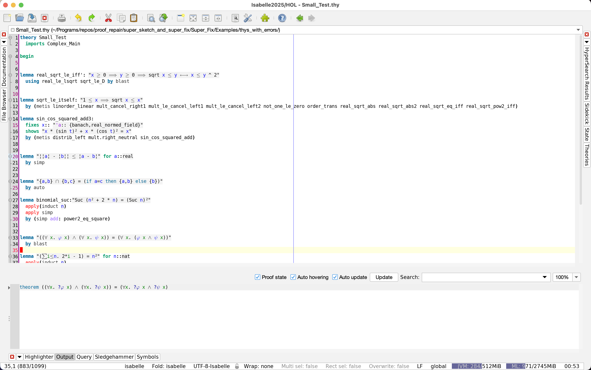

# The `super_sketch` and `super_fix` tools manual

This is the development repository for the `super_sketch` and `super_fix` tools presented in 
[*FormaliSE 2025*](https://conf.researchr.org/home/Formalise-2025#event-overview) for the 
[Isabelle](https://isabelle.in.tum.de/) proof assistant. 

The `super_sketch` tool automatically generates proofs for lemmas that may be split into 
multiple subgoals. It is based and inspired by Isabelle's *Sledgehammer* tool and Florian Haftman's 
[`Sketch_and_Explore`](https://isabelle.in.tum.de/dist/library/HOL/HOL-ex/Sketch_and_Explore.html)
library.

The `super_fix` tool was designed to automate the process of fixing an almost-correct theory file 
in the same way a human user would. The *almost-correct* usage refers to states where definitions, 
functions, and datatypes are assumed to be valid, but there are some proofs about them that are
not accepted, often due to an upstream modification of a definition.

Together with some Python scripting, these tools have helped in a large invariant verification 
project with 800 conjuncts and almost 54000 proof obligations. See below for usage examples.

## Requirements
  * The `supper_sketch` tool currently supports both Isabelle2023 and Isabelle2025.
    - To make it work for Isabelle2023, copy the files `Super2023.thy` and `SC2023.ML` into your working folder and import the theory as `Super2023`.
  * The `supper_fix` tool has been tested using Isabelle2025 in Unix systems.

## Getting started

### Isabelle

You can launch Isabelle2025 with the tools preloaded either via:

```bash
$ export PATH=$PATH:/full/path/to/your/Isabelle2025/bin
$ cd /full/path/to/this/project/repo/super_sketch_and_super_fix
$ isabelle jedit -d ./Super_Sketch
```

or 

```bash
$ export PATH=$PATH:/full/path/to/your/Isabelle2025/bin
$ cd /full/path/to/this/project/repo/super_sketch_and_super_fix
$ isabelle jedit -d ./Super_Fix
```

Alternatively, you could add them to your trusted Isabelle sessions (i.e. ROOTS) in 
`~/.isabelle/ROOTS` or `~/.isabelle/Isabelle2025/ROOTS` writing there the path to 
this project's `ROOTS` file.

### Super sketch

Invoke the utility by the command `super_sketch(...)`, where you fill in the `...` 
with some methods like `intro conjI`,`induct $VAR`, `cases $VAR` (where $VAR is a 
variable appearing in your theorem/lemma) and etc.

### Super fix

There are three steps to work with `super_fix`:
  - Locate an *almost-correct* `.thy` file (with some errors).
  - Create a fixer `.thy` file and run it with Isabelle2025.
  - Open the rewritten fixed file (a .backup file is created for you if the changes are not to your liking).

Below we provide a more detailed example of these steps on a `.thy` file provided by us.

1. Open this repo's `/Super_Fix/Examples/thys_with_errors/Small_Test.thy`. After 
waiting for it to load you should be able to see something similar to the snapshot 
below. You can see that the file contains errors by the red color (in the Theories panel 
and the bar next to the scrolling bar) and due to the last part of the 
message in the Output panel.



2. Let's automatically fix this file (`/Super_Fix/Examples/thys_with_errors/Small_Test.thy`) 
with `super_fix`. You can use the same method later for any of the other `.thy` files 
in the directory `/Super_Fix/Examples/thys_with_errors/` (or any other almost-correct file). 
To start, create a new `Small_Test.thy` file in this repository's 
`/Super_Fix/Examples/thy_manual_fixers/` directory (already provided) and copy the following
code-snippet to it. Notice that `super_fix` will tell you if the specified path is correct.
Adapt the path to your setup:

**WARNING**: It is important to preserve the *context* of the `.thy` file that is being 
fixed in the "fixer" file. Otherwise, the tool might fail. The places to pay attention are:
  1. the name of the files themselves must coincide, 
  2. the name between the command `theory` and the command `imports` should coincide,
  3. the imports should coincide (but the "fixer" file should import this repository's `Super_Fix.thy`)
  4. the input file to `super_fix` must be the correct one

```SML
theory Small_Test  
  imports 
    Super_Fix.Super_Fix
    Complex_Main
begin

super_fix HAMMER[simp]
  "/path/to/this/repo/Super_Fix/examples/thys_with_errors/Small_Test.thy"

end
```

**NOTE**: In this case, we asked `super_fix` to fix the `.thy` file by calling
`sledgehammer` (if the `simp` tactic failed). You can use different fixers: 
  - `SORRYS`
  - `TRY0` to use Isabelle's tool `try0`
  - `TRY` to use Isabelle's tool `try`
  - `LLM` to use an LLM running in a server on port `5006` that encloses its suggestions with a `<|eop|>` token (see the repository [DeepIsaHOL](https://github.com/yonoteam/DeepIsaHOL))

3. You will see Isabelle turn your code snippet into dark purple (see image below), which 
means that Isabelle is processing the file `Small_Test.thy` in `thys_with_errors`, replacing
any erroneous transition with `sorry`, and then calling `Sledgehammer` and all `sorry`s.
After processing the file, the purple shading will disappear but in the meantime you can see 
in the `Output` panel `super_fix`'s report of its progress.



4. Once the purple color disappears, you can see that the file 
`/Super_Fix/Examples/thys_with_errors/Small_Test.thy` has no errors. 
Yet, another file `Small_Test.backup` has been created if for some
bizarre reason you want the previous erroneous file &#128521;.



Congratulations! You have fixed a `.thy` file with `super_fix`. 

**WARNING** Remember that `super_fix` does not necessarily fix all errors:
  * In particular, `super_fix` ignores errors in proofs ending with `by` because Isabelle itself marks the `by` keyword as completing the proof (even if it is a failed conclusion). Thus, change all `by` statements with `apply...done`. 
  * If `super_fix` detects a goal it could not solve, it writes a `sorry`. Search for `sorry`s with Isabelle's search function. Places where `sorry`s are introduced require a proof-expert to look at the result, but you can try your luck calling `super_sketch`.